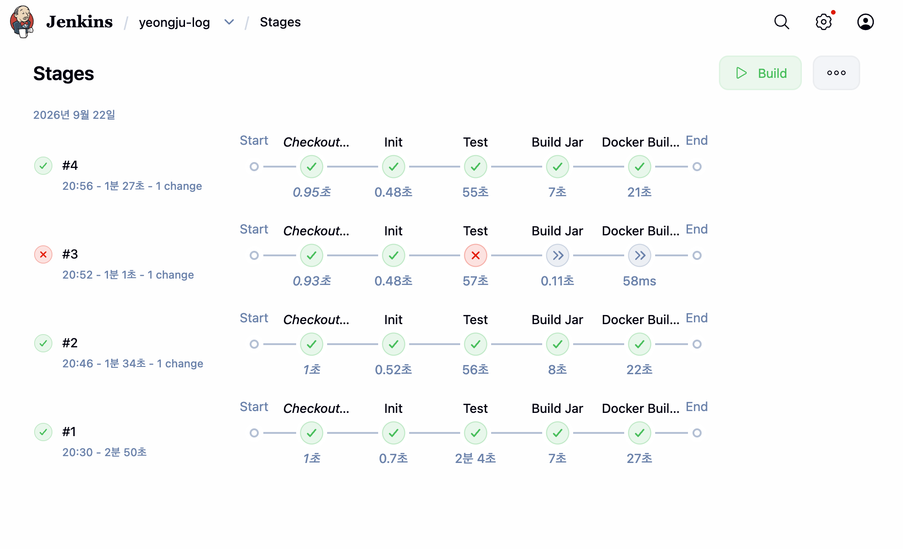
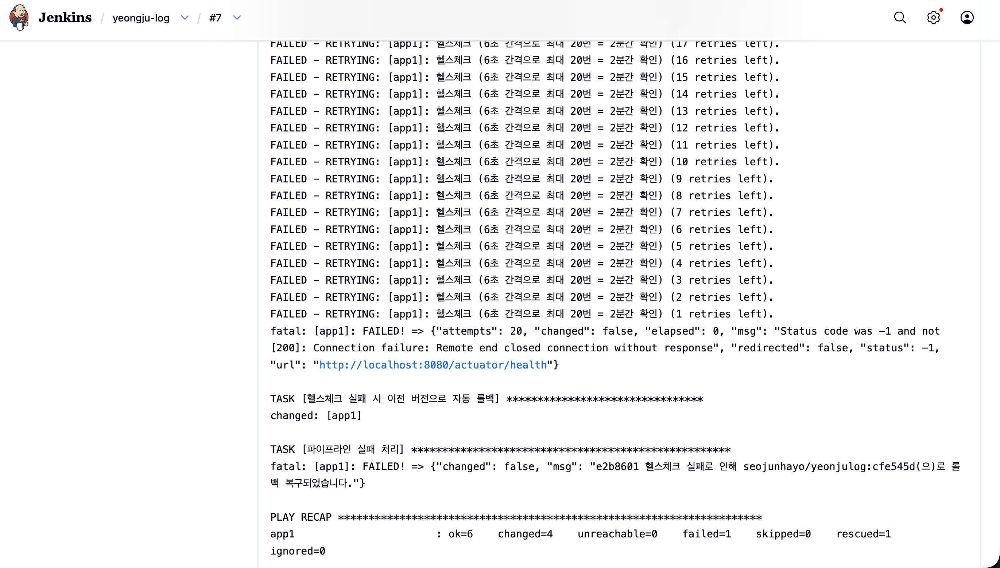
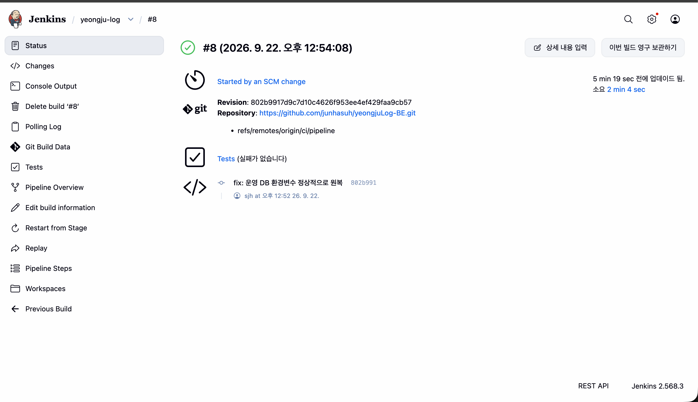

# 영주 Welcome Guide - Backend API

> 영주시의 역사적 맥락과 공공데이터를 결합한 **역사 탐방 가이드** 백엔드 시스템

---

## 프로젝트 개요

**영주 로그**는 금성대군의 역사를 중심으로 영주시의 주요 명소를 탐방하며 미션을 수행하는 위치기반 역사 게임입니다.

### 주요 기능
- **장소별 미션 시스템**: 소수서원, 소수박물관, 선비촌 등 실제 장소 방문 시 미션 활성화
- **밀서 조각 수집**: 3개의 밀서 조각을 모아 금성대군 신단 미션 해금
- **LLM 캐릭터 대화**: Gemini API를 활용한 금성대군, 주모, 유생 등과의 상호작용
- **맛집 추천**: 4개 공공데이터 통합, 가중치 기반 추천
- **시간 제약 미션**: 야간(20시 이후) 전용 순흥향교 미션
- **숙박시설 안내**: GPS 기반 농어촌민박 정보 제공

---

## 기술 스택

### Backend
- **Java 17**
- **Spring Boot 3.2.5**
- **Spring Data JPA** + **Querydsl**
- **MySQL 8.0**

### External API Integration
- **Spring Cloud OpenFeign**: 공공데이터 API 연동
- **WebClient**: Gemini API 비동기 호출

### API Documentation
- **Springdoc OpenAPI 3** (Swagger UI)

### 공공데이터 출처
- **ODCloud API**:
  - 착한가격업소
  - 지역사랑상품권 가맹점
  - 소수박물관 소장품

- **Data.go.kr API**:
  - 안심식당
  - 영주맛집
  - 농어촌민박

---

## 📂 프로젝트 구조

```
src/main/java/com/yeongju/
├── config/               # 설정 클래스
│   ├── FeignConfig.java
│   ├── SwaggerConfig.java
│   ├── WebConfig.java
│   └── InitDataLoader.java
│
├── controller/           # REST API 컨트롤러
│   ├── UserController.java
│   ├── MissionController.java
│   ├── LocationController.java
│   ├── RestaurantController.java
│   ├── AccommodationController.java
│   ├── ConversationController.java
│   ├── SecretLetterController.java
│   └── HealthController.java
│
├── domain/               # 도메인 엔티티
│   ├── user/
│   ├── location/
│   ├── mission/
│   ├── secretletter/
│   ├── restaurant/
│   ├── accommodation/
│   └── conversation/
│
├── dto/                  # Data Transfer Objects
│   ├── user/
│   ├── mission/
│   ├── location/
│   ├── restaurant/
│   ├── conversation/
│   └── common/
│
├── repository/           # JPA 리포지토리
│
├── service/              # 비즈니스 로직
│   ├── UserService.java
│   ├── MissionService.java
│   ├── LocationService.java
│   ├── RestaurantService.java
│   ├── AccommodationService.java
│   ├── LLMService.java
│   └── SecretLetterService.java
│
├── external/             # 외부 API 클라이언트
│   ├── odcloud/
│   └── datago/
│
└── exception/            # 예외 처리
    ├── BusinessException.java
    ├── ErrorCode.java
    └── GlobalExceptionHandler.java
```

---

## 🚀 시작하기

### 1. 사전 요구사항
- Java 17 이상
- MySQL 8.0
- Gradle 8.x
- Gemini API Key (선택사항)

### 2. 데이터베이스 설정

```sql
CREATE DATABASE yeongju_db CHARACTER SET utf8mb4 COLLATE utf8mb4_unicode_ci;
```

### 3. 프로젝트 실행

```bash
# Gradle 빌드
./gradlew clean build

# 애플리케이션 실행
./gradlew bootRun
```

서버는 기본적으로 `http://localhost:8080`에서 실행됩니다.

---

## 📖 API 문서

애플리케이션 실행 후 Swagger UI에서 API 문서를 확인할 수 있습니다:

**Swagger UI**: http://localhost:8080/api/swagger-ui.html

### 주요 API 엔드포인트

#### 1. 사용자 관리
- `POST /api/v1/users` - 사용자 생성 (회원가입)
- `GET /api/v1/users/{userId}` - 사용자 조회

#### 2. 미션
- `GET /api/v1/missions/location/{locationType}` - 장소별 미션 조회
- `POST /api/v1/missions/submit` - 미션 답안 제출

#### 3. 장소
- `GET /api/v1/locations` - 모든 장소 조회
- `GET /api/v1/locations/visible` - 일반 장소 조회
- `GET /api/v1/locations/hidden` - 히든 장소 조회

#### 4. 맛집
- `GET /api/v1/restaurants/nearby` - 근처 맛집 조회
- `POST /api/v1/restaurants/sync` - 맛집 데이터 동기화

#### 5. 숙박시설
- `GET /api/v1/accommodations/nearby` - 근처 숙박시설 조회
- `POST /api/v1/accommodations/sync` - 숙박시설 데이터 동기화

#### 6. LLM 대화
- `POST /api/v1/conversations/chat` - 캐릭터와 대화

#### 7. 밀서 조각
- `GET /api/v1/secret-letters/my` - 내가 수집한 밀서 조각
- `GET /api/v1/secret-letters/completed` - 밀서 완성 여부

---

## 🎮 게임 플로우

### 1단계: 튜토리얼
- 금성대군(도깨비불) 등장
- 게임 규칙 안내

### 2단계: 메인 미션 (자유 순서)
- **소수서원**: "숙수사" 정답 → 밀서 조각 #1 획득
- **소수박물관**: "1909" 정답 → 밀서 조각 #2 획득
- **소수 선비촌**: "일편단심" 정답 → 밀서 조각 #3 획득

### 3단계: 메인 엔딩
- **금성대군 신단**: 3개 밀서 수집 시 해금
- "이보흠" 정답 → 금성대군 성불
- 히든 장소(무섬마을, 부석사) 해금

### 4단계: 히든 미션 (선택)
- **무섬마을**: "아도서숙" 정답
- **부석사**: "배흘림" 정답
- **순흥향교**: 야간(20시 이후) 전용

### 상시 이용 가능
- **주막**: LLM 대화, 맛집 추천, 보너스 포인트

---

## 🔑 핵심 비즈니스 로직

### 1. 밀서 조각 시퀀스 시스템
```java
// 방문 장소와 무관하게 획득 순서대로 #1 → #2 → #3 자동 배정
// 3개 수집 시 자동으로 금성대군 신단 해금
user.incrementSecretLetterCount();
if (user.getSecretLetterCount() == 3) {
    user.unlockGoldShrine();
}
```

### 2. GPS 기반 맛집 가중치 정렬
```sql
-- 4개 공공데이터 중복 등록 시 상단 노출
-- Haversine 공식으로 거리 계산
SELECT *, 
  (is_gift_certificate + is_yeongju_restaurant + 
   is_safe_restaurant + is_fair_price_store) AS weight
FROM restaurants
ORDER BY weight DESC, distance ASC
```

### 3. 야간 전용 장소 로직
```java
// 순흥향교는 20시 이후에만 접근 가능
if (location.getRequiresNightTime() && !isNightTime()) {
    throw new BusinessException(ErrorCode.NIGHT_TIME_REQUIRED);
}
```

### 4. LLM 페르소나 시스템
```java
// 캐릭터별 System Prompt 적용
switch (characterType) {
    case GOLD_PRINCE -> "엄격하면서도 인자한 사극톤..."
    case TAVERN_OWNER -> "영주 사투리를 쓰는 정 많은 할머니..."
    case SCHOLAR_PARK -> "근대 지사의 차분하고 강인한 말투..."
}
```

---

## 📊 데이터베이스 ERD

### 주요 테이블
- **users**: 사용자 정보 (닉네임, 포인트, 밀서 수집 상태)
- **locations**: 장소 정보 (좌표, 히든 여부, 야간 전용)
- **missions**: 미션 정보 (질문, 정답, 보상)
- **mission_progress**: 유저별 미션 진행 상황
- **secret_letters**: 밀서 조각 (3개)
- **user_secret_letters**: 유저 밀서 수집 기록
- **restaurants**: 맛집 정보 (4개 공공데이터 통합)
- **accommodations**: 숙박시설 정보
- **conversation_history**: LLM 대화 이력


---

## 🌟 주요 특징

### 1. 공공데이터 통합 관리
- 4개 맛집 API 데이터를 단일 테이블로 통합
- 중복 등록 시 가중치 계산으로 신뢰도 높은 맛집 우선 노출
- 배지 시스템: 🏷️(상품권), ⭐(맛집), 🧼(안심), 💰(착한가격)

### 2. LLM 기반 몰입형 스토리텔링
- 캐릭터별 페르소나 시스템 프롬프트
- 무례한 발언 자동 필터링
- 대화 이력 기반 컨텍스트 유지
- 주막 긍정 단어 감지 시 보너스 포인트

### 3. 시퀀스 기반 진행 시스템
- 방문 순서 무관, 획득 순서로 밀서 배정
- 3개 수집 시 자동 엔딩 해금
- 엔딩 후 히든 장소 오픈

### 4. 시간 의존적 콘텐츠
- 서버 시간 기준 20시 이후 순흥향교 활성화
- 실시간 시간대 반영

### 5. Jenkins를 사용한 CI/CD 적용

팀 프로젝트로 만든 영주로그 백엔드를 포크해 CI/CD를 적용했다. 기존 애플리케이션에 테스트 설정, Dockerfile, Jenkinsfile, Ansible 배포 코드를 추가하는 작업은 개인적으로 진행했다.

먼저 EC2에서 Docker로 앱과 MySQL을 띄워 수동 배포를 확인했다. 이후 Jenkins가 테스트와 이미지 빌드를 맡고, Ansible이 앱 서버의 컨테이너를 교체하도록 연결했다. Jenkins 서버와 앱 서버는 EC2 두 대로 나눴다.

#### 배포 과정

    ci/pipeline 브랜치에 push
      → Jenkins가 Poll SCM으로 변경 확인 (2분 주기)
      → Gradle 테스트
      → JAR 빌드
      → Docker 이미지 빌드 및 Docker Hub push
      → Ansible로 앱 서버 컨테이너 교체
      → /actuator/health 확인

테스트가 실패하면 JAR와 Docker 이미지를 만드는 단계로 넘어가지 않는다. 이미지는 Jenkins 서버에서 한 번 빌드하고, 앱 서버에서는 받아서 실행한다. 태그에는 커밋 해시를 붙여 어떤 코드가 배포됐는지 확인하고 이전 버전으로 돌아갈 때도 사용했다.

테스트는 H2와 더미 설정값으로 실행하고, 실제 DB 접속 정보는 앱 서버의 env 파일에서 읽도록 분리했다. Docker Hub 토큰과 서버 접속용 SSH 키는 Jenkins Credentials에 등록했다.

배포 확인에는 `/actuator/health`를 사용했다. 기존 `/v1/health`는 DB 연결에 문제가 있어도 UP을 반환해서 배포 성공 여부를 판단하기 어려웠다. 컨테이너를 교체한 뒤 6초 간격으로 최대 20회 확인하고, 계속 실패하면 Ansible이 이전 이미지를 다시 실행한 뒤 Jenkins 빌드를 실패로 표시하도록 했다.

#### 실패 상황도 확인해 보기

정상 배포 외에 테스트가 깨졌을 때와 배포한 앱이 뜨지 않을 때도 확인했다.

**테스트 실패**

헬스체크 테스트를 일부러 실패시켰다. 빌드 #3에서 Test 단계가 실패했고, 이후 JAR 빌드와 Docker 단계는 실행되지 않았다.



**배포 실패와 롤백**

이번에는 운영 DB 환경변수 이름을 일부러 틀리게 바꿨다. 테스트는 H2를 사용하므로 통과했지만, 앱 서버에서는 DB에 연결하지 못했다. 빌드 #7에서 헬스체크가 20회 실패한 뒤 이전 이미지인 `cfe545d`로 돌아가는 것을 확인했다.



환경변수 이름을 원래대로 돌린 뒤에는 빌드 #8에서 `802b991` 이미지가 정상 배포됐다. 이때 테스트부터 배포 확인까지 2분 4초가 걸렸다.



#### 중간에 막혔던 부분

빌드 #5는 SUCCESS였는데 앱 서버의 컨테이너는 이전 버전 그대로였다. Jenkins의 실행 단계를 확인해 보니 Deploy가 아예 없었다.

원인은 `ansible/` 디렉터리 안에서 실행한 `git add .`였다. 상위 경로에 있던 Jenkinsfile 수정이 커밋에 빠져, Jenkins는 배포 단계가 없는 기존 파일로 실행되고 있었다. 저장소 루트에서 Jenkinsfile을 추가해 다시 push한 뒤 컨테이너가 교체되는 것을 확인했다.

이때 빌드 성공 표시만으로는 배포까지 됐다고 볼 수 없다는 걸 확인했다. 실제로 어떤 단계가 실행됐는지와 앱 서버에서 어떤 이미지가 실행 중인지도 함께 봐야 했다.

현재는 기존 컨테이너를 내리고 새 컨테이너를 띄우는 방식이라 배포 중 서비스가 잠시 끊긴다. 중단 시간은 아직 측정하지 않았다. 또 `ddl-auto: update`를 사용하고 있어 이전 이미지로 돌아가더라도 DB 스키마까지 복구되는 것은 아니다. AWS 자격 증명도 환경변수로 받는 상태라, EC2 IAM 역할을 사용하는 방식으로 바꾸는 작업이 남아 있다.

---

## 👥 기여자

- **Backend Developer**: junha seo